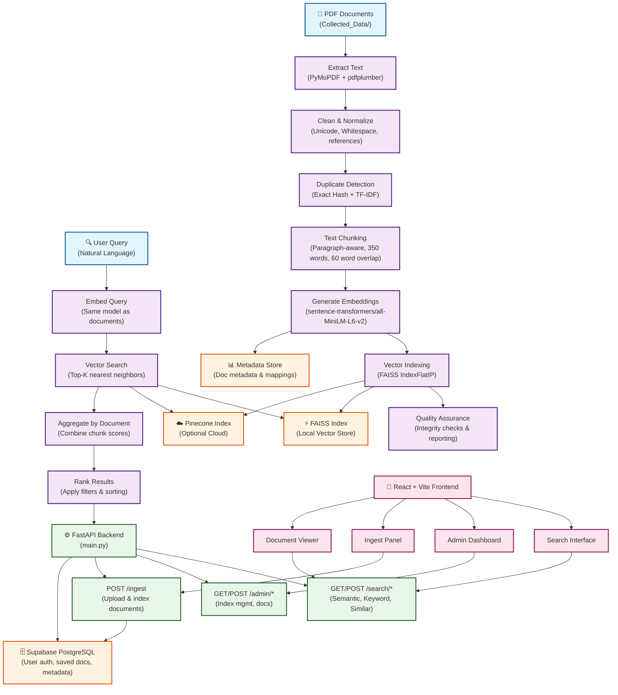

# NLP_Project_1

This repository is organized into two main application folders:

- `frontend/` - React + Vite user interface
- `backend/` - FastAPI API and embedded NLP indexing/search engine

## System Architecture



## Structure

- `frontend/` contains the Vite app, env template, and Netlify-facing frontend assets.
- `backend/` contains the API, backend env template, requirements, and the embedded NLP pipeline under `backend/University-Semantic-Search-System/`.
- `supabase/` contains SQL and helper scripts for Supabase setup and cleanup.

## Current admin capabilities

- Search/index status overview
- Recent ingest activity
- Metadata editing for stored documents
- Delete flow that removes Supabase metadata/storage and rebuilds the local index from remaining bucket files
- Local cache/index reset
- Citation and BibTeX copy support in the frontend

## Run locally

### Backend

```powershell
.\.venv\Scripts\python.exe backend\run.py
```

### Frontend

```powershell
cd frontend
npm install
npm run dev
```

## Env templates

- Frontend env template: `frontend/.env.example`
- Backend env template: `backend/.env.example`


## 1.3 System Design

### 1.3.1 High-Level Architecture

```
┌─────────────────────────────────────────────────────────────────────────────────┐
│                           OFFLINE INDEXING PIPELINE                             │
├─────────────────────────────────────────────────────────────────────────────────┤
│  PDFs → Extract → Clean → Chunk → Embed → Vector Index + Metadata               │
│  (Batch Processing)                                                             │
└─────────────────────────────────────────────────────────────────────────────────┘
                                          │
                                          ▼
┌─────────────────────────────────────────────────────────────────────────────────┐
│                         ONLINE QUERY PATH (FastAPI Backend)                     │
├─────────────────────────────────────────────────────────────────────────────────┤
│  Query → Embed → Vector Search → Aggregate by Doc → Rank → API Response        │
└─────────────────────────────────────────────────────────────────────────────────┘
                                          │
                                          ▼
┌─────────────────────────────────────────────────────────────────────────────────┐
│                         INTERACTIVE WEB UI (React + Vite)                       │
├─────────────────────────────────────────────────────────────────────────────────┤
│  Search Interface | Results Display | Admin Dashboard | Document Management      │
└─────────────────────────────────────────────────────────────────────────────────┘
```

**Key Design Principles:**
1. **Separation of Concerns:** Indexing pipeline (offline) separate from search engine (online)
2. **Vector Store Abstraction:** FAISS (on-premise) or Pinecone (cloud) with common interface
3. **Modularity:** Each pipeline stage (extract, clean, chunk, embed, index) can run independently
4. **Reproducibility:** Fixed random seeds, version logging, comprehensive reporting
5. **Scalability:** Batch processing with configurable parameters

### 1.3.2 Detailed Component Design

#### 1.3.2.1 Pipeline Architecture

```
OFFLINE INDEXING PIPELINE
├── Stage 1: Text Extraction (PyMuPDF + pdfplumber)
│   ├── Input: PDF file
│   ├── Process: Extract text with fallback handling
│   ├── Output: Raw text + extraction metadata
│   └── File: backend/app/pipeline/extraction.py
│
├── Stage 2: Text Cleaning & Normalization
│   ├── Input: Raw extracted text
│   ├── Process: Remove formatting artifacts, normalize Unicode, detect abstracts
│   ├── Output: Cleaned text + abstract
│   └── File: backend/app/pipeline/cleaning.py
│
├── Stage 3: Duplicate Detection
│   ├── Input: Cleaned texts
│   ├── Process: Exact hash + near-duplicate TF-IDF similarity
│   ├── Output: Duplicate groups and flagged documents
│   └── File: backend/app/pipeline/duplicates.py
│
├── Stage 4: Text Chunking
│   ├── Input: Cleaned text
│   ├── Process: Paragraph-aware, sentence-aware, overlap-preserving chunking
│   ├── Parameters: target_words=350, min=250, max=450, overlap=60
│   ├── Output: List of text chunks with position tracking
│   └── File: backend/app/pipeline/chunking.py
│
├── Stage 5: Embedding Generation
│   ├── Input: Text chunks
│   ├── Model: sentence-transformers/all-MiniLM-L6-v2 (384-dim embeddings)
│   ├── Process: Batch embedding with token length truncation
│   ├── Output: Embeddings for each chunk (float32 numpy arrays)
│   └── File: backend/app/pipeline/embeddings.py
│
├── Stage 6: Vector Indexing
│   ├── Input: Embeddings + chunk metadata
│   ├── Process: FAISS IndexFlatIP for cosine similarity
│   ├── Output: FAISS index file + chunk metadata mapping
│   └── File: backend/app/pipeline/faiss_index.py
│
├── Stage 7: Quality Assurance
│   ├── Input: All pipeline artifacts
│   ├── Checks: Embedding quality (NaN/Inf), index integrity, self-retrieval
│   ├── Output: QA report (HTML/Markdown)
│   └── File: backend/app/pipeline/qa_reporting.py
│
└── Stage 8: Reporting & Visualization
    ├── Input: All pipeline outputs
    ├── Process: Generate summary report, EDA visualizations
    ├── Output: Comprehensive pipeline report
    └── File: backend/app/pipeline/eda_visualizations.py
```

#### 1.3.2.2 Semantic Search Engine Design

```python
SemanticSearchEngine
├── Components:
│   ├── EmbeddingModel: sentence-transformers/all-MiniLM-L6-v2
│   ├── VectorStore: IVectorStore interface
│   │   ├── Implementation 1: FaissVectorStore (default, local)
│   │   └── Implementation 2: PineconeVectorStore (cloud, optional)
│   └── ChunkMetadataStore: Mapping of chunk_id → (doc_id, text, page)
│
├── Query Processing:
│   ├── 1. Embed query using same model as documents
│   ├── 2. Search vector store (top-K nearest neighbors)
│   ├── 3. Aggregate results by document ID
│   ├── 4. Rank by aggregate similarity score
│   └── 5. Apply optional filters and sorting
│
└── Features:
    ├── Semantic search: embedding-based relevance
    ├── Similar documents: find related work
    ├── Keyword search: TF-IDF/BM25 baseline
    ├── Filtered search: by year, department, level
    ├── Full text retrieval: access complete document content
    └── Citation support: BibTeX and standard citation formats
```

**File:** `backend/University-Semantic-Search-System/NLP-Pipeline/NLP Data/backend/app/semantic_engine.py`

#### 1.3.2.3 Web Backend API Design

```
FastAPI Application (backend/app/main.py)
├── Core Endpoints:
│   ├── GET /ping → Health check
│   ├── POST /search/semantic → Semantic search with filters
│   ├── POST /search/keyword → Keyword baseline search
│   ├── POST /search/similar → Find similar documents
│   ├── GET /documents/{doc_id}/full-text → Full document text
│   ├── POST /ingest → Upload documents for indexing
│   ├── POST /ingest-from-url → Index from Supabase URL
│   └── GET /ingest/{job_id} → Monitor ingest job status
│
├── Admin Endpoints:
│   ├── GET /admin/documents → List all indexed documents
│   ├── GET /admin/index-status → Index statistics
│   ├── GET /admin/ingest-jobs → Ingestion history
│   ├── PATCH /admin/documents/{doc_id} → Update metadata
│   ├── DELETE /admin/documents/{doc_id} → Delete document
│   └── POST /admin/reset-index → Rebuild indexes
│
├── User Endpoints:
│   ├── POST /documents/save → Save document to user library
│   ├── GET /documents/saved → Get user's saved documents
│   └── DELETE /documents/saved/{doc_id} → Unsave document
│
└── Middleware:
    ├── CORS for frontend integration
    ├── Authentication via Supabase
    ├── API key validation
    └── Request/response logging
```

**File:** `backend/app/main.py`  
**Schema:** `backend/app/schemas.py` (Pydantic models)  
**Services:** `backend/app/services.py` (Business logic)

#### 1.3.2.4 Frontend UI Design

```
React + Vite Application (frontend/)
├── Pages:
│   ├── SearchPage: Main search interface
│   │   ├── Search input with autocomplete
│   │   ├── Advanced filters (year, department, level, supervisor)
│   │   ├── Results display with snippets
│   │   ├── Sorting options (relevance, date, title)
│   │   └── Pagination controls
│   │
│   ├── RelatedWorksPage: Find similar documents
│   │   └── Related documents recommendations
│   │
│   ├── DocumentFullTextPage: View full document content
│   │   ├── Full text display
│   │   ├── Citation export (BibTeX)
│   │   └── Download button with token sharing
│   │
│   ├── LibraryPage: User's saved documents
│   │   ├── Manage saved documents
│   │   └── Personal notes and annotations
│   │
│   ├── AdminPage: Administrative dashboard
│   │   ├── Index status and statistics
│   │   ├── Document management
│   │   ├── Ingestion monitoring
│   │   └── Batch operations
│   │
│   ├── IngestionPage: Upload documents for indexing
│   │   ├── File upload interface
│   │   ├── Batch upload support
│   │   └── Progress tracking
│   │
│   └── DashboardPage: Overview and statistics
│       ├── System metrics
│       └── Quick actions
│
├── Components:
│   ├── SearchPanel: Search query and filters
│   ├── DocumentCard: Individual result display
│   ├── AdminDocumentList: Document management table
│   ├── AdminIndexStatus: Index statistics display
│   ├── AdminIngestionPanel: Batch upload interface
│   ├── AdminIngestJobs: Job monitoring
│   ├── AuthDialog: Login/signup interface
│   ├── PreviewModal: Document preview
│   └── SimilarityPanel: Related documents display
│
└── Services:
    ├── api/client.ts: API client with auth
    ├── lib/supabase.ts: Supabase integration
    ├── lib/citation.ts: Citation format support
    └── types/domain.ts: TypeScript interfaces
```

**Framework:** React 18 + TypeScript  
**Build Tool:** Vite  
**Styling:** CSS + Tailwind CSS  
**State Management:** React Hooks + Context API  
**Routing:** React Router v6

### 1.3.3 Data Flow Diagram

```
                ┌─────────────────────────────────┐
                │   User PDF Documents             │
                │  (Collected_Data/ directory)     │
                └──────────────┬──────────────────┘
                               │
                    ┌──────────▼──────────┐
                    │  Text Extraction     │
                    │  (PyMuPDF + fallback)│
                    └──────────┬──────────┘
                               │
                    ┌──────────▼──────────┐
                    │  Text Cleaning      │
                    │  (Normalization)    │
                    └──────────┬──────────┘
                               │
                    ┌──────────▼──────────┐
                    │ Duplicate Detection  │
                    │ (Exact + Near)      │
                    └──────────┬──────────┘
                               │
                    ┌──────────▼──────────┐
                    │  Text Chunking      │
                    │ (Paragraph-aware)   │
                    └──────────┬──────────┘
                               │
                    ┌──────────▼──────────┐
                    │ Embedding Generation │
                    │ (Sentence-BERT)     │
                    └──────────┬──────────┘
                               │
              ┌────────────────┴────────────────┐
              │                                 │
    ┌─────────▼─────────┐        ┌────────────▼────────────┐
    │ FAISS Index       │        │ Pinecone Index (Cloud)   │
    │ (Local Storage)   │        │ (Optional)               │
    └─────────┬─────────┘        └────────────┬────────────┘
              │                               │
              └───────────────┬───────────────┘
                              │
                    ┌─────────▼────────┐
              ┌────►│ Search Engine     │◄────┐
              │     │ (Vector Search)   │     │
              │     └─────────┬────────┘     │
              │               │              │
        ┌─────┴──────┐  ┌─────▼──────────┐  │
        │FastAPI API │  │ Web UI         │  │
        │Backend     │  │ (React/Vite)  │  │
        └────────────┘  └────────────────┘  │
                        │
                    ┌───▼────────────────┐
                    │ Supabase Auth &     │
                    │ Storage             │
                    └────────────────────┘
```

### 1.3.4 Technology Stack

| Layer | Technology | Purpose |
|---|---|---|
| **Embedding Model** | sentence-transformers/all-MiniLM-L6-v2 | Semantic representation (384 dims) |
| **Vector DB (Primary)** | FAISS (IndexFlatIP) | On-premise local indexing |
| **Vector DB (Cloud)** | Pinecone | Optional cloud-based indexing |
| **Text Extraction** | PyMuPDF (fitz) + pdfplumber | PDF to text conversion |
| **NLP Pipeline** | Custom Python modules | Extract → Clean → Chunk → Embed |
| **Web Framework** | FastAPI (Python) | REST API backend |
| **Frontend** | React 18 + TypeScript + Vite | Interactive web UI |
| **Database** | Supabase (PostgreSQL) | Auth, metadata, document storage |
| **Authentication** | Supabase Auth | User login and session management |
| **Deployment** | Docker + Railway | Cloud containerization |
| **Testing** | pytest + coverage | Quality assurance |
| **Configuration** | YAML | Pipeline configuration management |

### 1.3.5 System Design Justification

#### Why FAISS over Pinecone by Default?
- **Cost**: FAISS is free, open-source; no API costs for scale
- **Latency**: Local queries are fast (<100ms)
- **Control**: Full data control on-premise
- **Flexibility**: Easy to customize and extend

#### Why Sentence-BERT (all-MiniLM-L6-v2)?
- **Efficiency**: Only 22M parameters; runs on CPU
- **Quality**: Proven performance on semantic search tasks
- **Size**: 384-dim embeddings; good accuracy-speed tradeoff
- **Pre-trained**: No fine-tuning needed for academic text

#### Why Paragraph-Aware Chunking?
- **Coherence**: Maintains semantic units within paragraphs
- **Overlap**: 60-word overlap prevents information loss at boundaries
- **Flexibility**: Target 350 words with 250-450 range to handle varied document types

#### Why FastAPI over Flask?
- **Performance**: Async support for better concurrency
- **Validation**: Built-in Pydantic schema validation
- **Documentation**: Auto-generated OpenAPI specs
- **Modern**: Native type hints and async/await support

