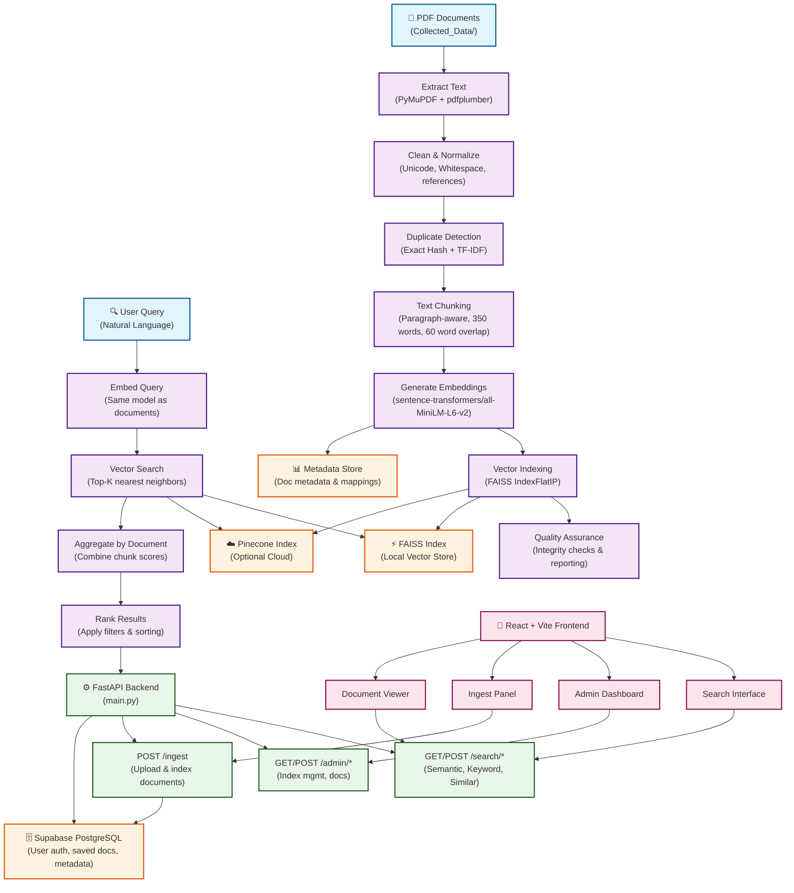

# NLP_Project_1

This repository is organized into two main application folders:

- `frontend/` - React + Vite user interface
- `backend/` - FastAPI API and embedded NLP indexing/search engine

## System Architecture



## Structure

- `frontend/` contains the Vite app, env template, and Netlify-facing frontend assets.
- `backend/` contains the API, backend env template, requirements, and the embedded NLP pipeline under `backend/University-Semantic-Search-System/`.
- `supabase/` contains SQL and helper scripts for Supabase setup and cleanup.

## Current admin capabilities

- Search/index status overview
- Recent ingest activity
- Metadata editing for stored documents
- Delete flow that removes Supabase metadata/storage and rebuilds the local index from remaining bucket files
- Local cache/index reset
- Citation and BibTeX copy support in the frontend

## Run locally

### Backend

```powershell
.\.venv\Scripts\python.exe backend\run.py
```

### Frontend

```powershell
cd frontend
npm install
npm run dev
```

## Env templates

- Frontend env template: `frontend/.env.example`
- Backend env template: `backend/.env.example`
